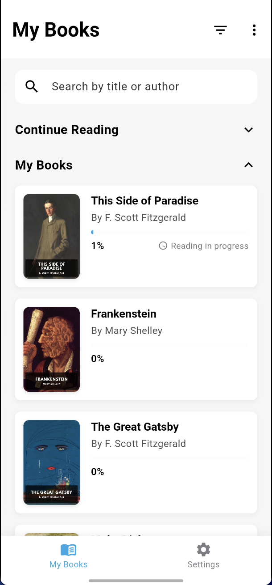
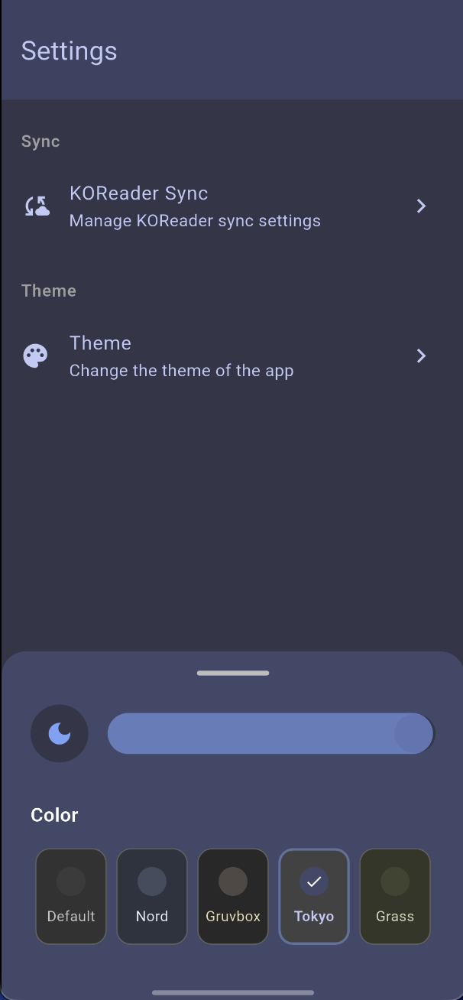
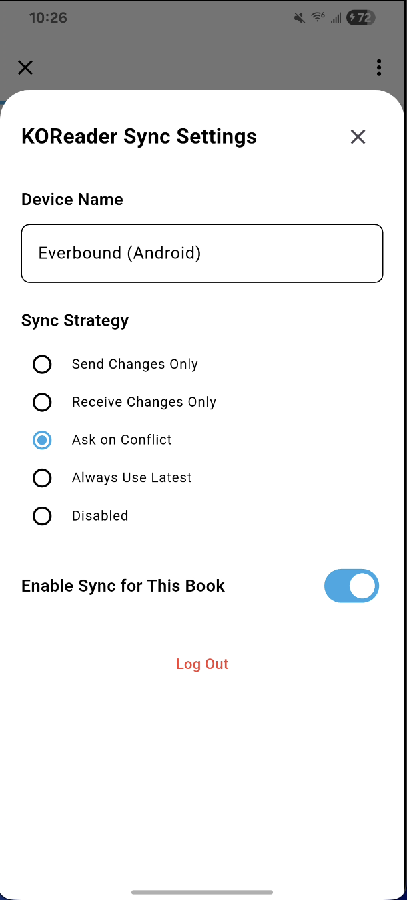
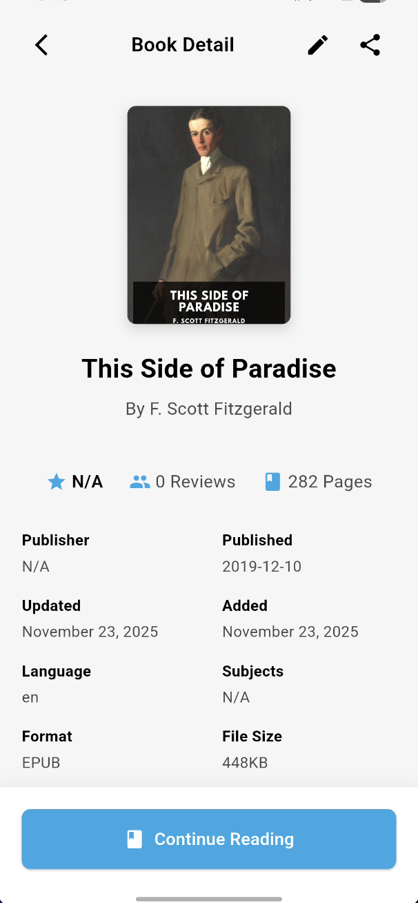
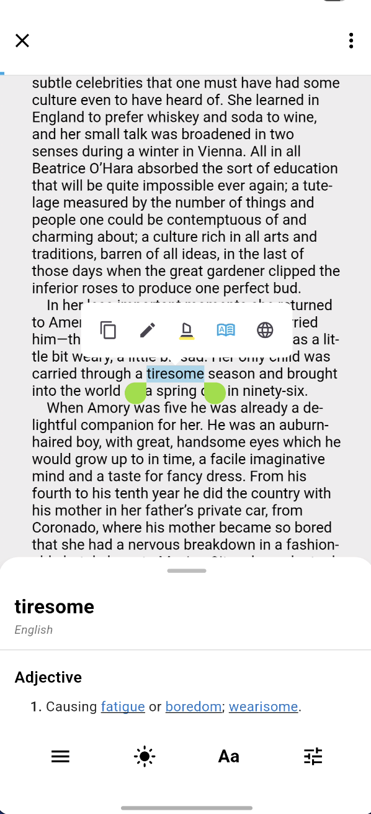

<div align="center">

  <h1>Everbound</h1>

  <br>

[Everbound][link-github] is an open-source ebook reader built with Flutter, designed for immersive and deep reading experiences. Built on top of [foliate-js](https://github.com/johnfactotum/foliate-js), it delivers a smooth, native mobile experience on Android and iOS.

[![GitHub][badge-github]][link-github]

[![Platform][badge-platforms]][link-github]

[![License][badge-license]](LICENSE)

[![Last commit][badge-last-commit]][link-gh-commits]

[![Buy Me A Coffee][badge-donate]][link-donate]

</div>

<p align="center">

  <a href="#features">Features</a> •

  <a href="#planned-features">Planned Features</a> •

  <a href="#screenshots">Screenshots</a> •

  <a href="#getting-started">Getting Started</a> •

  <a href="#support">Support</a> •

  <a href="#license">License</a>

</p>

## Features

<div align="left">✅ Implemented</div>

| **Feature**                             | **Description**                                                                                                | **Status** |
| --------------------------------------- | -------------------------------------------------------------------------------------------------------------- | ---------- |
| **EPUB Support**                        | Full support for EPUB format with rich rendering                                                               | ✅         |
| **Annotations and Highlighting**        | Add highlights with multiple colors and styles (highlight, underline, squiggly) to enhance your reading experience. | ✅         |
| **Customize Font and Layout**           | Adjust font size, theme mode, and theme colors for a personalized experience.                                 | ✅         |
| **Multiple Reading Themes**             | Choose from various built-in themes optimized for day and night reading.                                       | ✅         |
| **Resume Reading**                      | Automatically resume from your last reading position.                                                           | ✅         |
| **Library Management**                  | Organize and manage your entire ebook library with local storage.                                              | ✅         |
| **KOReader Sync Support**               | Synchronize reading progress, notes, and bookmarks with [KOReader][link-koreader] devices and sync servers.    | ✅         |
| **WebDAV File Import**                  | Import books directly from WebDAV servers for seamless cloud library access.                                  | ✅         |
| **Local File Import**                   | Import EPUB files from local storage or file picker.                                                           | ✅         |
| **Dictionary Lookup**                   | Instantly look up words with Wiktionary integration.                                                           | ✅         |
| **Volume Key Navigation**               | Navigate pages using volume keys for hands-free reading.                                                       | ✅         |

## Planned Features

<div align="left">🚧 In Development</div>

<div align="left">📋 Planned</div>

| **State** | **Feature**                                | **Description**                                                                            |
| --------- | ------------------------------------------ | ------------------------------------------------------------------------------------------ |
| 🚧        | **Windows, macOS, Linux Support**          | Extend Everbound to desktop platforms for cross-platform reading.                         |
| 🚧        | **Web App Support**                        | Bring Everbound to the web for browser-based reading.                                      |
| 📋        | **Additional Cloud Sources**               | Support for more cloud storage providers beyond WebDAV.                                    |
| 📋        | **Full-Text Search**                       | Search across the entire book to find relevant sections.                                    |
| 📋        | **Multi-Format Support**                  | Support for MOBI, KF8 (AZW3), FB2, CBZ, TXT, and PDF formats.                            |
| 📋        | **Text-to-Speech (TTS)**                  | Enjoy smooth, multilingual narration for accessible reading.                               |
| 📋        | **Advanced Reading Stats**                 | Track reading time, pages read, and more for detailed insights.                           |
| 📋        | **In-Library Full-Text Search**            | Search across your entire ebook library to find topics and quotes.                         |

Stay tuned for continuous improvements and updates! Contributions and suggestions are always welcome—let's build the ultimate reading experience together. 😊

## Screenshots












---

## Getting Started

To get started with Everbound, follow these steps to clone and build the project.

### 1. Clone the Repository

```bash

git clone https://github.com/yourusername/everbound.git

cd everbound

```

### 2. Install Dependencies

```bash

flutter pub get

```

### 3. Verify Flutter Setup

To confirm that Flutter is correctly installed, run:

```bash

flutter doctor

```

This command will display information about your Flutter installation and any potential issues that need to be resolved.

### 4. Build for Development

```bash

# Run on Android

flutter run

# Run on iOS (macOS only)

flutter run

```

### 5. Build for Production

```bash

# Build Android APK

flutter build apk

# Build Android App Bundle

flutter build appbundle

# Build iOS (macOS only)

flutter build ios

```

## Requirements

- **Flutter SDK** (latest stable version recommended)
- **Android Studio** or **VS Code** with Flutter extensions
- **Xcode** (for iOS development, macOS only)
- **Android SDK** (for Android development)

For detailed setup instructions, refer to the [Flutter documentation](https://docs.flutter.dev/get-started/install).

## KOReader Sync Setup

Everbound supports synchronization with KOReader devices and sync servers. To set up sync:

1. Navigate to Settings → Sync Servers
2. Add your KOReader sync server URL
3. Enter your username and user key
4. Configure sync strategy (send, receive, prompt, or disabled)
5. Enable sync for individual books as needed

For more information about KOReader sync, visit the [KOReader documentation][link-koreader].

## WebDAV Import Setup

To import books from a WebDAV server:

1. Navigate to Settings → File Sources
2. Add a new WebDAV source
3. Enter your WebDAV server URL, username, and password
4. Select the folder containing your EPUB files
5. Scan and import books from the selected folder

## Support

If Everbound has been useful to you, consider supporting its development. You can [buy me a coffee][link-donate] to help keep the project going. Your contribution helps us squash bugs faster, improve performance, and keep building great features.

## License

Everbound is free software: you can redistribute it and/or modify it under the terms of the [GNU Affero General Public License](https://www.gnu.org/licenses/agpl-3.0.html) as published by the Free Software Foundation, either version 3 of the License, or (at your option) any later version. See the [LICENSE](LICENSE) file for details.

The following libraries and frameworks are used in this software:

- [foliate-js](https://github.com/johnfactotum/foliate-js), which is MIT licensed.

- [Flutter](https://github.com/flutter/flutter), which is BSD-3-Clause licensed.

---

<div align="center" style="color: gray;">Happy reading with Everbound!</div>

[badge-github]: https://img.shields.io/badge/github-everbound-blue

[badge-license]: https://img.shields.io/github/license/yourusername/everbound?color=teal

[badge-platforms]: https://img.shields.io/badge/platforms-Android%2C%20iOS-green

[badge-last-commit]: https://img.shields.io/github/last-commit/yourusername/everbound?color=blue

[badge-donate]: https://img.shields.io/badge/Buy%20Me%20A%20Coffee-support-yellow?logo=buy-me-a-coffee

[link-github]: https://github.com/yourusername/everbound

[link-gh-commits]: https://github.com/yourusername/everbound/commits/main

[link-koreader]: https://github.com/koreader/koreader

[link-donate]: https://buymeacoffee.com/NathenxBrewer

